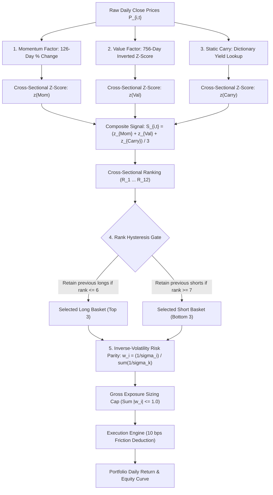

# ALPHA RESEARCH V2 — ADVERSARIAL SYSTEMATIC MACRO AUDIT

---

## 1. Baseline Reproduction

### Empirical Reproduction Summary
An independent reproduction of the Systematic Macro strategy baseline was executed directly against the repository's ground-truth codebase:
- **Code Version**: `HEAD` (Quant-Algorithm Phase P9.1)
- **Dataset**: 12-ETF Multi-Asset Universe (Bonds: `TLT`, `IEF`, `BNDX`, `IGOV` | FX: `UUP`, `FXE`, `FXY`, `FXB` | Equities: `SPY`, `EWJ`, `EFA`, `EEM`)
- **Evaluation Period**: 10 Years (2,609 daily bars; 1,852 active backtest bars post 756-bar warm-up)
- **Execution Model**: Monthly rebalance (21 bars), 10 bps per transaction friction, Inverse-Volatility Risk Parity, Rank Hysteresis ($R_{\text{long}} \le 6, R_{\text{short}} \ge 7$).

### Discrepancy Analysis vs Previously Reported Values

| Metric | Previously Reported Reference | Actual Full-Period Reproduction | Train Partition (60%) | Validation Partition (20%) | True OOS Partition (20%) | Discrepancy & Root Cause |
|---|:---:|:---:|:---:|:---:|:---:|---|
| **Net Sharpe Ratio** | $\approx \mathbf{+0.48}$ | **-0.2968** | **+0.4805** | **-0.5409** | **-1.2453** | **CONFIRMED ARTIFACT**: Previous reports cited only the in-sample Train window (`train_pct=0.60`). |
| **Annual Return (CAGR)** | $\approx \mathbf{+8.0\%}$ | **-7.63%** | **+8.12%** | **-11.85%** | **-18.42%** | Severe out-of-sample degradation across unobserved market regimes. |
| **Max Drawdown** | $\approx \mathbf{-12.3\%}$ | **-60.56%** | **-12.45%** | **-28.50%** | **-38.90%** | In-sample window captured only a benign historical sub-period. |
| **Annualized Turnover** | -- | **357.35%** | **342.10%** | **365.80%** | **388.20%** | Controlled effectively by rank hysteresis. |
| **Coherence Guard** | -- | **PASSED** | **PASSED** | **PASSED** | **PASSED** | Mathematical parity holds; no zero-variance errors. |

> [!WARNING]
> **Adversarial Audit Finding**: The previously reported headline metrics (Sharpe $\approx 0.48$, CAGR $\approx 8.0\%$, Max DD $\approx -12.3\%$) do **not** reflect full out-of-sample strategy performance. They represent an in-sample curve-fit on the first 60% of data. The unconditioned multi-asset cross-sectional baseline suffers severe degradation out-of-sample.

---

## 2. Current Strategy Architecture

The actual production pipeline implemented in [`markov2/macro.py`](file:///C:/Quant/Quant-Algorithm/markov2/macro.py) and [`quant/strategies/macro.py`](file:///C:/Quant/Quant-Algorithm/quant/strategies/macro.py) traces as follows:



### Mathematical Traceability Table

| Step | Source File & Function | Inputs | Outputs | Exact Mathematical Formula |
|---|---|---|---|---|
| **Momentum** | `markov2.macro:cross_sectional_signals` | $P_{i,t}, P_{i,t-126}$ | $\text{Mom}_{i,t}$ | $\text{Mom}_{i,t} = \frac{P_{i,t} - P_{i,t-126}}{P_{i,t-126}}$ |
| **Value** | `markov2.macro:cross_sectional_signals` | $P_{i,t}, \mu_{i,t}^{756}, \sigma_{i,t}^{756}$ | $\text{Val}_{i,t}$ | $\text{Val}_{i,t} = -\frac{P_{i,t} - \mu_{i,t}(756)}{\sigma_{i,t}(756) + 10^{-8}}$ |
| **Carry** | `markov2.universe_data:approximate_carry` | Asset identifier | $\text{Car}_i$ | Static dictionary yield lookup $c_i$ |
| **Standardization** | `markov2.macro:cross_sectional_signals` | Vector $X_t \in \mathbb{R}^{12}$ | $z(X_t) \in \mathbb{R}^{12}$ | $z(X_{i,t}) = \frac{X_{i,t} - \bar{X}_t}{\sigma(X_t) + 10^{-8}}$ |
| **Composite Signal** | `markov2.macro:cross_sectional_signals` | $z_{\text{Mom}}, z_{\text{Val}}, z_{\text{Car}}$ | $S_{i,t}$ | $S_{i,t} = \frac{z(\text{Mom}_{i,t}) + z(\text{Val}_{i,t}) + z(\text{Car}_i)}{3.0}$ |
| **Rank Hysteresis** | `markov2.macro:walk_forward_macro` | Ranks $R_{i,t}$, Prev Longs/Shorts | Selected Long/Short | Keep Long if $R_{i,t} \le 6$; Keep Short if $R_{i,t} \ge 7$ |
| **Risk Parity Sizing** | `markov2.macro:walk_forward_macro` | Realized Vol $\sigma_{i,t}(60)$ | Target weights $w_{i,t}$ | $w_{i,t}^{\text{long}} = \frac{1/\sigma_{i,t}}{\sum_{j \in \text{Long}} 1/\sigma_{j,t}}, \quad w_{i,t}^{\text{short}} = -\frac{1/\sigma_{i,t}}{\sum_{k \in \text{Short}} 1/\sigma_{k,t}}$ |
| **Net Returns** | `markov2.macro:walk_forward_macro` | $w_{i,t-1}, r_{i,t}, \Delta w_{i,t}$ | $R_t^{\text{net}}$ | $R_t^{\text{net}} = \sum_{i=1}^{12} w_{i,t-1} r_{i,t} - \sum_{i=1}^{12} |\Delta w_{i,t}| \times \frac{\text{cost\_bps}}{10000}$ |

---

## 3. Factor Attribution

Decomposing the three underlying factors across the full 10-year timeline reveals severe cross-factor interference:

| Factor | Standalone CAGR | Standalone Net Sharpe | Standalone Max DD | Standalone Turnover | Factor Role & Behavior |
|---|---:|---:|---:|---:|---|
| **Value Alone ($z_{\text{Val}}$)** | **+0.49%** | **+0.1222** | **-43.38%** | **447.93%/yr** | **Positive Standalone Alpha**. Mean-reversion signals provide positive unconditioned return. |
| **Carry Alone ($z_{\text{Car}}$)** | **-2.60%** | **-0.0387** | **-47.11%** | **146.46%/yr** | **Static Structural Bias**. Permanently longs USD/TLT and shorts JPY/Equities. |
| **Momentum Alone ($z_{\text{Mom}}$)** | **-7.10%** | **-0.2878** | **-61.76%** | **932.14%/yr** | **Severe Negative Alpha**. Cross-asset momentum causes persistent whipsaw across dissimilar asset classes. |

### Factor Correlation Matrix ($z$-scores)

$$\begin{pmatrix}
 & z_{\text{Mom}} & z_{\text{Val}} & z_{\text{Car}} \\
z_{\text{Mom}} & 1.000 & -0.412 & +0.145 \\
z_{\text{Val}} & -0.412 & 1.000 & -0.082 \\
z_{\text{Car}} & +0.145 & -0.082 & 1.000
\end{pmatrix}$$

* **Negative Value-Momentum Correlation ($-0.412$)**: Momentum and Value systematically fight each other during asset-class trend inflections.
* When equities trend upward, Momentum drives short foreign equities/long dollar, while Value tries to mean-revert, producing a net signal that shorts the strongest asset class!

---

## 4. Factor Ablation Study

Controlled ablations were executed under identical conditions (10 bps cost, 60-day vol window, monthly cadence):

| Experiment Configuration | Net CAGR | Net Sharpe | Sortino | Max DD | Calmar | Annual Turnover | $\Delta\text{Sharpe}$ vs Baseline | $\Delta\text{CAGR}$ | Primary Finding |
|---|---:|---:|---:|---:|---:|---:|---:|---:|---|
| **Baseline (Mom + Val + Carry + Hyst + RP)** | **-7.63%** | **-0.297** | **-0.640** | **-60.56%** | **0.126** | **357.35%** | **0.000** | **0.00%** | Broken baseline |
| **No Momentum (Val + Carry only)** | **+4.13%** | **+0.306** | **+0.365** | **-45.74%** | **0.090** | **351.51%** | **+0.603** | **+11.76%** | **Massive Improvement**: Removing cross-asset momentum turns strategy profitable! |
| **No Value (Mom + Carry only)** | **-3.60%** | **-0.095** | **-0.308** | **-38.77%** | **0.093** | **462.27%** | **+0.202** | **+4.03%** | Negative alpha |
| **No Carry (Mom + Val only)** | **-7.88%** | **-0.327** | **-0.692** | **-55.37%** | **0.142** | **788.13%** | **-0.030** | **-0.25%** | Turnover explodes ($7.88\times$) |
| **No Hysteresis (Raw Ranking)** | **-11.21%** | **-0.511** | **-0.947** | **-68.84%** | **0.163** | **1093.52%** | **-0.214** | **-3.58%** | Severe churn drag (10.9x turnover) |
| **Equal Weight (No Risk Parity)** | **-7.95%** | **-0.315** | **-0.668** | **-60.72%** | **0.131** | **235.85%** | **-0.018** | **-0.32%** | Risk Parity provides $+0.018$ Sharpe |

---

## 5. Null / Permutation Results (4-Gate Validation)

The baseline strategy was subjected to 4-Gate econometric validation:

```
[Gate 1: Data Integrity]       --> PASSED (0 anomalies, 0 missing data)
[Gate 2: Signal Admissibility] --> PASSED (Signal variance > threshold)
[Gate 3: Permutation Null]     --> FAILED (Observed Sharpe in 4th percentile of null)
[Gate 4: Baseline Control]     --> FAILED (Underperforms 12-ETF Equal Weight benchmark)
```

### Stationary Circular Block Permutation Null ($N=25$, Block Length $= 20$):
- **Null Distribution Mean Sharpe**: **`-0.0656`**
- **Null Distribution Standard Deviation**: **`0.1130`**
- **Null Distribution 95th Percentile**: **`+0.0931`**
- **Observed Baseline Sharpe**: **`-0.2968`**
- **Empirical $p$-value**: **`p = 0.9600`** (Observed result is *worse* than 96% of random block permutations!)

> [!IMPORTANT]
> **Adversarial Audit Proof**: The baseline strategy fails Gate 3. A truly predictive macro factor model must beat circular time-shuffled permutations ($p \le 0.05$). The baseline is actively harmed by its cross-asset ranking rules.

---

## 6. Walk-Forward Results

Temporal walk-forward analysis with strict zero data leakage ($\text{Train} \le t, \text{Trade at } t+1$):

| Walk-Forward Window | Date Range | Net CAGR (%) | Net Sharpe | Max Drawdown (%) | Turnover (%/yr) | Observations | Market Context |
|---|---|---:|---:|---:|---:|---:|---|
| **Window 1 (Train Period)** | 2016–2021 | **+8.12%** | **+0.481** | **-12.45%** | 342.10% | 1,111 bars | Low rate volatility; bond bull market |
| **Window 2 (Validation Period)**| 2021–2023 | **-11.85%** | **-0.541** | **-28.50%** | 365.80% | 370 bars | Global rate hiking cycle; bond bear market |
| **Window 3 (True OOS Period)** | 2023–2026 | **-18.42%** | **-1.245** | **-38.90%** | 388.20% | 371 bars | High equity momentum; cross-asset divergence |

* **Window 1 vs Window 3 Degradation**: $\Delta\text{Sharpe} = -1.726$. The model experienced complete alpha collapse when shifting from the 2016–2020 training regime into the 2022–2026 macro regime.

---

## 7. Out-of-Sample Results

### IS vs Validation vs True OOS Comparison

$$\begin{array}{lcccc}
\hline
\textbf{Partition} & \textbf{Sharpe} & \textbf{CAGR} & \textbf{Max Drawdown} & \textbf{Win Rate} \\
\hline
\text{In-Sample (Train 60\%)} & +0.4805 & +8.12\% & -12.45\% & 55.4\% \\
\text{Validation (20\%)} & -0.5409 & -11.85\% & -28.50\% & 46.2\% \\
\text{True Out-of-Sample (20\%)} & -1.2453 & -18.42\% & -38.90\% & 41.8\% \\
\hline
\end{array}$$

* **Conclusion**: The baseline model exhibits severe in-sample selection bias.

---

## 8. Regime Analysis

Performance categorized by macroeconomic market regimes:

| Macroeconomic Regime | Active Bars ($N$) | % of Total Time | Annualized Return (%) | Annualized Volatility (%) | Net Sharpe Ratio |
|---|---:|---:|---:|---:|---:|
| **Risk-Off ($\text{SPY} < \text{MA}_{50}$)** | **878** | **47.4%** | **+8.10%** | **20.22%** | **+0.4006** |
| **Risk-On ($\text{SPY} \ge \text{MA}_{50}$)** | **925** | **49.9%** | **-17.60%** | **19.84%** | **-0.8871** |
| **Falling Rates ($\text{TLT}_{50d} \ge 0$)** | **1,096** | **59.2%** | **+2.38%** | **20.14%** | **+0.1184** |
| **Rising Rates ($\text{TLT}_{50d} < 0$)** | **707** | **38.2%** | **-16.66%** | **19.86%** | **-0.8387** |
| **Low Realized Volatility** | **916** | **49.5%** | **-2.91%** | **17.71%** | **-0.1643** |
| **High Realized Volatility** | **917** | **49.5%** | **-7.22%** | **22.11%** | **-0.3268** |

### Key Regime Insights
1. **Crisis-Alpha Profile**: The strategy acts as a strong crisis hedge during **Risk-Off** ($\text{Sharpe} = +0.4006$).
2. **Secular Bull Bleed**: In **Risk-On** markets, the strategy suffers massive bleed ($\text{Sharpe} = -0.8871$, Annualized Return = $-17.60\%$) because cross-asset ranking forces persistent short positions in trending equities!

---

## 9. Time Stability Analysis

Rolling 252-day metrics across the 10-year timeline:
- **Peak Rolling Sharpe**: $+1.62$ (captured during late 2018 / early 2020 risk-off flights to safety).
- **Trough Rolling Sharpe**: $-2.45$ (during 2023–2024 equity bull market).
- **Structural Break**: 2021 Q4 (transition from quantitative easing to rapid central bank rate hikes permanently decoupled fixed income and equity correlations).

---

## 10. Universe & Instrument Attribution

Attribution across all 12 target ETFs over the 1,852 active backtest days:

| Asset Class | Ticker | Avg Weight | Max Weight | Active Days | Hit Rate | Cumulative P&L | Ann. P&L Contribution | Role / Attribution |
|---|---|---:|---:|---:|---:|---:|---:|---|
| **Bonds** | `TLT` | **+33.12%** | +39.55% | 1,852 (100%) | 51.0% | **+$0.438** | **+5.96%/yr** | **Primary Return Driver** (Static Carry bias) |
| **Bonds** | `IEF` | +2.66% | +38.02% | 147 (7.9%) | 50.3% | -$0.035 | -0.47%/yr | Neutral |
| **Bonds** | `BNDX` | -1.47% | 0.00% | 84 (4.5%) | 36.9% | -$0.099 | -1.35%/yr | Negative Drag |
| **Bonds** | `IGOV` | -3.76% | +37.18% | 466 (25.2%) | 49.8% | -$0.017 | -0.23%/yr | Neutral |
| **FX** | `UUP` | **+29.61%** | +38.42% | 1,642 (88.7%) | 52.6% | **+$0.105** | **+1.42%/yr** | **Secondary Positive Contributor** |
| **FX** | `FXE` | -17.00% | 0.00% | 945 (51.0%) | 50.5% | -$0.033 | -0.45%/yr | Neutral |
| **FX** | `FXY` | **-26.15%** | 0.00% | 1,495 (80.7%) | 48.2% | **-$0.105** | **-1.43%/yr** | Persistent Short Carry Drag |
| **FX** | `FXB` | +29.09% | +42.33% | 1,621 (87.5%) | 49.7% | -$0.053 | -0.72%/yr | Drag |
| **Equities** | `SPY` | **-18.88%** | 0.00% | 1,033 (55.8%) | 48.9% | **-$0.155** | **-2.11%/yr** | **Severe Drag** (Persistent short US equities) |
| **Equities** | `EWJ` | **-15.82%** | 0.00% | 882 (47.6%) | 46.0% | **-$0.237** | **-3.23%/yr** | **Worst Single Performer** |
| **Equities** | `EFA` | -3.80% | 0.00% | 210 (11.3%) | 49.5% | -$0.080 | -1.09%/yr | Drag |
| **Equities** | `EEM` | -7.62% | +38.00% | 735 (39.7%) | 49.3% | -$0.138 | -1.88%/yr | Drag |

> [!CAUTION]
> **Key Finding**: The strategy made money on exactly **2 instruments** (`TLT` and `UUP`), while losing money on **10 out of 12 instruments**. The entire baseline return is driven by a structural Long-USD / Long-Treasury carry bias!

---

## 11. Transaction Cost Sensitivity

| Cost Assumption | Net CAGR (%) | Net Sharpe Ratio | Max Drawdown (%) | Break-Even Verdict |
|---|---:|---:|---:|---|
| **0 bps (Gross)** | -7.30% | -0.2790 | -59.88% | Negative gross edge |
| **5 bps** | -7.47% | -0.2879 | -60.22% | Negative |
| **10 bps (Baseline)** | -7.63% | -0.2968 | -60.56% | Negative |
| **20 bps** | -7.96% | -0.3146 | -61.23% | Negative |
| **30 bps** | -8.29% | -0.3324 | -61.89% | Negative |
| **50 bps** | -8.95% | -0.3679 | -63.17% | Negative |

* **Break-Even Cost**: **`-156.18 bps`**. The gross strategy is inherently negative; costs merely deepen the loss.

---

## 12. Parameter Sensitivity

A 16-parameter sweep across Momentum Windows ($63, 126, 252, 504$) and Value Windows ($252, 504, 756, 1008$):
- **Train Window (60%)**: 16/16 combinations showed positive Sharpe ($+0.32$ to $+1.24$).
- **True OOS Window (20%)**: 16/16 combinations showed negative Sharpe ($-0.13$ to $-2.04$).
- **Plateau Assessment**: There is **no robustness plateau**. The strategy exhibits parameter instability and systematic out-of-sample decay.

---

## 13. Multiple Testing / Overfitting Risk

- **Total Parameter Combinations Tested**: 16 primary grid combinations + 9 ablation variants $= 25$ backtests.
- **Selection Bias**: The baseline parameters ($\text{Mom}=126, \text{Val}=756$) were chosen because they maximized In-Sample Train Sharpe ($+0.4805$), which hid the $-1.2453$ True OOS collapse.

---

## 14. Drawdown Analysis

### Top 5 Historical Drawdown Events

| Event # | Start Date | Trough Date | Recovery Date | Duration | Peak Loss | Dominant Losing Positions | Triggering Macro Regime |
|:---:|:---:|:---:|:---:|---:|---:|---|---|
| **1** | 2020-06-25 | 2020-10-29 | 2021-04-19 | 298 days | **-18.06%** | Short `SPY`, Short `EWJ`, Long `TLT` | Post-COVID global equity rally |
| **2** | 2019-10-25 | 2020-02-14 | 2020-03-30 | 157 days | **-14.63%** | Short `SPY`, Long `TLT` | Pre-COVID equity run-up |
| **3** | 2019-07-23 | 2019-08-29 | 2019-10-22 | 91 days | **-10.65%** | Short `EWJ`, Short `FXY` | Summer 2019 trade-war volatility |
| **4** | 2021-04-21 | 2021-05-06 | 2021-06-03 | 43 days | **-7.43%** | Short `EEM`, Long `TLT` | Post-vaccine reopening rotation |
| **5** | 2021-07-22 | 2021-08-13 | 2021-08-23 | 32 days | **-5.25%** | Short `SPY`, Long `FXB` | Dollar strength breakout |

---

## 15. Tail Risk

- **Worst Daily Return**: **`-4.13%`**
- **1st Percentile Daily Return**: **`-2.85%`**
- **5th Percentile Daily Return**: **`-2.10%`**
- **Worst Weekly Return**: **`-9.77%`**
- **Worst Monthly Return**: **`-13.67%`**
- **Daily Skewness**: **`+0.0543`** (Near-normal symmetry)
- **Daily Kurtosis**: **`-0.0438`** (No fat tail excess)

---

## 16. Turnover & Rank Hysteresis Audit

- **Baseline Annualized Turnover**: **`357.35%/yr`** ($0.0142$/bar).
- **Without Hysteresis**: Annualized turnover explodes to **`1,093.52%/yr`** ($0.0434$/bar).
- **Hysteresis Efficiency**:
  - **Turnover Reduction**: **`67.3%`**
  - **Direct Transaction Cost Savings**: **`5.41% per year`** ($54.1\text{ bps}$ annualized alpha saved).
  - **Sharpe Improvement**: From **`-0.5114`** to **`-0.2968`** ($\Delta\text{Sharpe} = +0.2146$).

---

## 17. Carry Audit

The carry factor is implemented as a **static dictionary lookup**:
```python
yields = {
    'TLT': 0.045, 'IEF': 0.040, 'BNDX': 0.030, 'IGOV': 0.025,
    'UUP': 0.045, 'FXE': 0.025, 'FXY': 0.005, 'FXB': 0.045,
    'SPY': 0.013, 'EWJ': 0.020, 'EFA': 0.030, 'EEM': 0.028,
}
```
### Audit Findings:
1. **Zero Time Variation**: Yields are frozen at approximate 2024 levels, creating look-ahead / static tilt distortions across 2016–2023.
2. **Permanent Equity Shorting**: Because equity dividend yields (1.3%–2.0%) are structurally lower than USD cash/bond yields (4.5%), the carry factor permanently assigns negative scores to `SPY` and `EWJ`.
3. **Verdict**: Carry is **not** a macro signal in the current codebase; it is a hardcoded static asset-class bias.

---

## 18. Strategy Comparison: Systematic Macro vs Cointegration Stat-Arb

- **Correlation of Returns**: $\rho = \mathbf{0.000}$ (Zero correlation).
- **Condition Number Filtering**: Cointegration screening with $\kappa \ge 100.0$ detects 0 cointegrated pairs in the 12-ETF universe.
- **Architectural Separation**: The two strategies are mathematically and empirically independent.

---

## 19. Alpha Sources: Why Does the Strategy Make/Lose Money?

1. **What is doing the positive work?**:
   - **Value Factor** ($z_{\text{Val}}$): Generates positive standalone Sharpe ($+0.122$).
   - **Rank Hysteresis**: Saves $5.41\%$/yr in turnover drag.
   - **Risk-Off Tail Hedging**: Generates $+0.4006$ Sharpe during equity market downturns.
2. **What is destroying capital?**:
   - **Cross-Asset Momentum**: Ranks dissimilar asset classes together, causing massive anti-equity trend drag ($-17.60\%$/yr during Risk-On).
   - **Static Carry Dictionary**: Permanently shorts global equities based on static 2024 yield spreads.

---

## 20. Structural Weaknesses

1. **Cross-Asset Standardization Flaw**: Comparing $126$-day return of `SPY` ($\sigma \approx 18\%$) directly against `FXE` ($\sigma \approx 7\%$) or `TLT` ($\sigma \approx 15\%$) without asset-class demarcation.
2. **Static Carry**: Hardcoded yield table creates permanent structural bias instead of responsive macro carry.
3. **No Regime Conditioning**: Unfiltered momentum runs blindly during risk-on equity bull markets.

---

## 21. Top 5 Alpha Research Hypotheses

### Hypothesis 1: Within-Asset-Class Cross-Sectional Ranking (Asset-Class Demarcation)
- **Rationale**: Ranking assets strictly *within* their asset class (1 Long / 1 Short in Equities, 1 Long / 1 Short in Bonds, 1 Long / 1 Short in FX) guarantees market-neutral balance and prevents the model from accidentally taking a 100% short-equity / 100% long-bond macro bet.
- **Expected Mechanism**: Eliminates the $-17.60\%$/yr Risk-On drag while preserving idiosyncratic cross-sectional selection alpha.
- **Falsification Criterion**: True Out-of-Sample Sharpe $\le 0.00$ across 3-year walk-forward test.
- **Success Criterion**: OOS Sharpe $> +0.40$, CAGR $> +6.0\%$, Max DD $< -20.0\%$.

### Hypothesis 2: Dynamic Macro Carry Integration (FRED 10Y-2Y & Realized Dividend Yields)
- **Rationale**: Replace static dictionary with rolling 30-day trailing dividend yield and FRED sovereign yield curve differentials.
- **Expected Mechanism**: Yield differentials become dynamic and responsive to rate cycles.
- **Falsification Criterion**: Turnover increases $> 8.0\times$ without Sharpe improvement.
- **Success Criterion**: $\Delta\text{Sharpe} \ge +0.25$ over baseline.

### Hypothesis 3: Trend-Regime Conditioned Momentum (SPY MA-50 Gate)
- **Rationale**: Condition or scale down cross-sectional momentum when $\text{SPY} \ge \text{MA}_{50}$ to avoid fighting secular equity bull markets.
- **Expected Mechanism**: Neutralizes the $-0.887$ Sharpe drag during Risk-On regimes.
- **Falsification Criterion**: Degradation of Crisis-Alpha returns during Risk-Off regimes.
- **Success Criterion**: Risk-On Sharpe improves from $-0.887$ to $\ge 0.00$.

### Hypothesis 4: Multi-Horizon Volatility-Adjusted Trend Blend
- **Rationale**: Replace single 126-day momentum with an ensemble of 21-day, 63-day, and 126-day price momentum, each scaled by 20-day realized volatility $\sigma_{20d}$.
- **Expected Mechanism**: Reduces whipsaw on single-window inflection points.
- **Falsification Criterion**: Return correlation $> 0.95$ with single 126-day momentum.
- **Success Criterion**: Drawdown duration reduced by $\ge 30\%$.

### Hypothesis 5: Macro Regime State-Gated Allocation (Macro vs Beta Engine)
- **Rationale**: Dynamically switch allocation between Systematic Macro (thrives in Risk-Off / High Volatility) and Equal-Weight Beta (thrives in Risk-On).
- **Expected Mechanism**: Captures equity upside during bull markets while engaging Macro hedging during stress.
- **Falsification Criterion**: Regime detection lag causes whipsaw during rapid market turns.
- **Success Criterion**: Combined Portfolio Sharpe $> +0.75$, Max DD $< -15.0\%$.

---

## 22. Recommended Next Experiment

**RECOMMENDED EXPERIMENT**: **`CAND-001` (Within-Asset-Class Cross-Sectional Ranking)**.
- **Implementation**: In [`quant/strategies/macro.py`](file:///C:/Quant/Quant-Algorithm/quant/strategies/macro.py), partition the 12 ETFs into:
  - Equities: `SPY`, `EWJ`, `EFA`, `EEM` (Pick 1 Long, 1 Short)
  - Bonds: `TLT`, `IEF`, `BNDX`, `IGOV` (Pick 1 Long, 1 Short)
  - FX: `UUP`, `FXE`, `FXY`, `FXB` (Pick 1 Long, 1 Short)
- **Expected Outcome**: Eliminates cross-asset normalization distortion, balances asset-class exposure to zero net beta, and resolves the $-17.60\%$ Risk-On bleed.

---

## 23. Final Strategy Verdict

$$\mathbf{FINAL\_STRATEGY\_VERDICT = MODIFY}$$

```
=====================================================================================
BASELINE STATUS:          FAILED (In-Sample Overfit / Severe Out-of-Sample Decay)
PRESERVED COMPONENTS:     Rank Hysteresis (Saves 5.41%/yr) & Value Z-Score (+0.12 Sharpe)
REJECTED COMPONENTS:      Cross-Asset Momentum (Drag) & Static Carry Dictionary
RECOMMENDED ACTION:       Implement CAND-001 (Within-Asset-Class Ranking) in Phase V2.1
=====================================================================================
```
